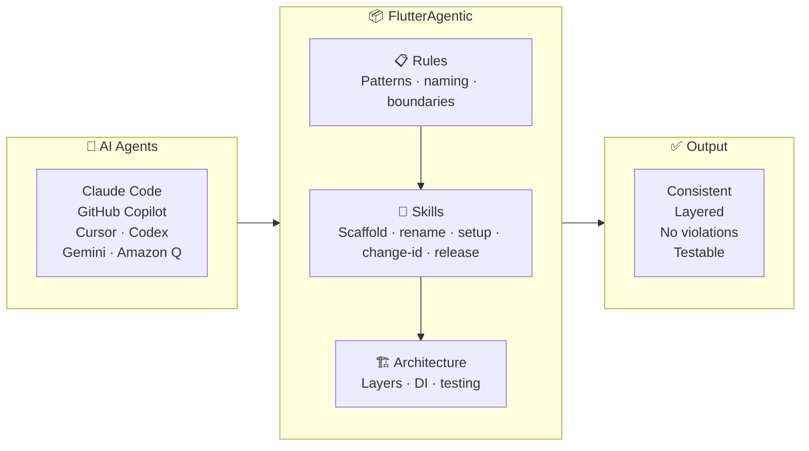
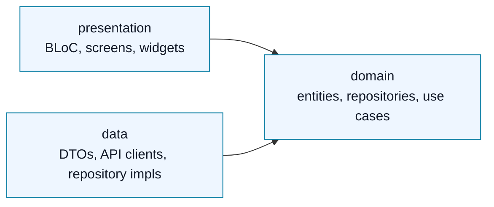

# FlutterAgentic

<p>
  
  
  
  
</p>

**An open-source, AI-first Flutter frontend starter.**

[View releases →](https://github.com/abhinav503/flutter-agentic/releases)

FlutterAgentic gives Flutter developers a production-grade Clean Architecture foundation that AI coding agents can actually follow. Fork it, open it in Claude Code, Codex, GitHub Copilot, Cursor, Gemini, Android Studio, or Amazon Q, and the agent gets the same architecture rules, forbidden patterns, naming conventions, test expectations, and feature scaffolding docs that a human teammate would use.

Most Flutter starters give you folders. FlutterAgentic gives you a rulebook plus a runnable app structure, so AI-generated code is less likely to drift into random widgets, leaked DTOs, untestable state, or inconsistent feature layouts.

The documentation is organised with the [Diataxis](https://diataxis.fr/) framework, so both humans and AI agents can quickly separate task guides, exact architecture reference, project reasoning, and operational coding rules.

## Why AI Agents Need Rules, Skills & Architecture

Think of an AI agent like a talented contractor joining your team. Without a handbook, every contractor codes differently — different file names, different patterns, different assumptions. After five features the codebase is a mess no one wants to touch.

FlutterAgentic is the handbook. Every agent that opens this repo gets the same rules, the same scaffold skills, and the same architecture blueprint — before writing a single line.



## AI Agent Support

FlutterAgentic includes repo-native instructions for Claude Code, Codex CLI, Cursor, Gemini, Android Studio, GitHub Copilot, and Amazon Q.

| Agent | Instruction source | Setup / scaffold path |
|---|---|---|
|  | `CLAUDE.md` | `/setup-project`, `/add-feature-template` |
|  | `AGENTS.md` + `.codex/skills/` | `$setup-project`, `$add-feature-template <name>` |
|  | `.github/copilot-instructions.md` | Repo-wide instructions; path-specific instructions can live in `.github/instructions/` |
|  | `.cursor/rules/` | Ask to set up or scaffold a feature |
|  | `GEMINI.md` | Ask to set up or scaffold a feature |
|  | `AGENTS.md` | Ask to set up or scaffold a feature |
|  | `.amazonq/rules/` | Rules are loaded from the repo |

Available skills:

- `setup-project` — checks Flutter/Dart setup, dependencies, generated files, hooks, run targets, and analysis.
- `add-feature-template` — scaffolds a new Clean Architecture feature with folders, class skeletons, BLoC state, screen/page files, and DI wiring.
- `rename-app` — renames the app across all platform files (iOS, Android, Web), Dart source, test imports, VS Code config, and all AI rules docs in one pass.
- `change-app-id` — changes the application ID / bundle identifier on Android (`build.gradle.kts` + `MainActivity.kt` package path) and iOS (`project.pbxproj`), with Xcode manual instructions and provisioning notes included.
- `review-code` — audits generated or modified code against the project's architecture contracts, forbidden-pattern checklist, naming conventions, DI rules, and test coverage expectations. Run this after any code generation for best results.
- `connect-firebase` — connects an app to a Firebase project: Firebase + FlutterFire CLI checks, `flutterfire configure`, per-app `firebase_core`, `main.dart` init, Android Gradle plugin, and the Xcode `GoogleService-Info.plist` step.
- `add-notification-feature` — adds Firebase Cloud Messaging push notifications (token, foreground/background/terminated handling, tap-to-open-a-page routing, image notifications) split into shared Flutter code plus separate iOS and Android tracks. Builds on `connect-firebase`.
- `release` — guides a full release from any branch: branch comparison, version bump, release notes, merge to main, GitHub Release creation, and branch cleanup.

## Why Fork This?

AI can generate Flutter quickly. The hard part is keeping the codebase consistent after the fifth feature.

FlutterAgentic is built for developers who want:

- A Flutter frontend template that is open-source and community-improvable
- Clean Architecture feature folders from day one
- BLoC + Freezed sealed events/states with exhaustive UI rendering
- `Either<Failure, T>` error handling instead of thrown exceptions across layers
- Dio networking via a single `HttpService` with repository-level failure mapping
- GoRouter navigation and a central DI graph
- Design tokens and reusable UI atoms instead of hardcoded styling
- Agent instructions for Claude, Codex, Copilot, Cursor, Gemini, Android Studio, and Amazon Q
- A repeatable path for adding features without asking the AI to invent structure

The core project is Flutter-first. Backend, React, Node.js, Python, or other folders may become optional community examples later, but the main product is a high-quality Flutter frontend starter.

## At A Glance

| Area | Included |
|---|---|
| App shape | Flutter frontend starter with two real reference apps — request/response (`doc_scanner`) and streaming (`ai_chat`) — plus a demo (`jokes`) |
| Architecture | Feature-first Clean Architecture with strict layer boundaries |
| AI support | Repo-native instructions for seven AI coding surfaces |
| State | BLoC events/states generated with Freezed |
| Quality gates | Git hooks, analysis, tests, CI, and generated-code workflow |
| Extension path | Add features through documented scaffolding rules |

## How It Is Different

| Alternative | What it gives you | FlutterAgentic difference |
|---|---|---|
| Regular Flutter boilerplates | App folders, dependencies, sometimes example screens | Adds explicit AI-agent rules, forbidden patterns, docs, scaffold flow, tests, and architecture contracts |
| Paid AI Flutter starters like [Create Flutter App](https://createflutterapp.com/) | AI-optimised Flutter template with backend/product modules | FlutterAgentic is open-source, Flutter-frontend-first, and designed for community improvement |
| Paid kits with AI rules like [ApparenceKit](https://apparencekit.dev/flutter-templates/claude-rules/) | Commercial Flutter templates with `CLAUDE.md` rules for their architecture | FlutterAgentic ships multi-agent rules plus the runnable app, CI, tests, design tokens, and feature structure |
| Standalone skills like [building-flutter-apps](https://www.awesomeskills.dev/en/skill/sgaabdu4-building-flutter-apps) | An installable AI-agent skill for Flutter patterns | FlutterAgentic is repo-native: any new Flutter dev can fork, run, edit, and contribute to the app, rules, docs, examples, and verification commands together |

## Stack

| Concern | Library |
|---|---|
| State management | [flutter_bloc](https://pub.dev/packages/flutter_bloc) |
| Dependency injection | [get_it](https://pub.dev/packages/get_it) — composition-root-only service locator; all domain and data classes use pure constructor injection |
| Navigation | [go_router](https://pub.dev/packages/go_router) |
| Networking | [Dio](https://pub.dev/packages/dio) via a single `HttpService` (`get` / `post` / `postStream`) |
| Models / serialization | [Freezed](https://pub.dev/packages/freezed) + [json_serializable](https://pub.dev/packages/json_serializable) |
| Error handling | [fpdart](https://pub.dev/packages/fpdart) (`Either<Failure, T>`) |
| Image picking | [image_picker](https://pub.dev/packages/image_picker) via `ImagePickerService` static singleton |

## Documentation System

The docs use the [Diataxis](https://diataxis.fr/) approach: separate docs by the reader's need instead of mixing everything into one long guide. Diataxis defines four documentation modes: tutorials, how-to guides, reference, and explanation.

| Need | Folder | Purpose |
|---|---|---|
| Do a task | [`docs/how-to/`](docs/how-to/) | Step-by-step guides for setup, contribution, features, and use cases |
| Look up exact rules | [`docs/reference/`](docs/reference/) | Architecture, naming, dependency boundaries, DI, error flow, and tests |
| Understand why | [`docs/explanation/`](docs/explanation/) | Product vision, agent setup, and reasoning behind the template |
| Guide AI agents | [`docs/ai-rules/`](docs/ai-rules/) | Operational conventions loaded by agent instruction files |

Tutorial-style docs can be added later when the project has more real app examples.

## Architecture

This is a **Dart pub-workspace monorepo**: one shared `core` package consumed by multiple Flutter apps. One `flutter pub get` at the repo root resolves everything, and editing `packages/core` is picked up live by any running app.

```text
flutter_agentic/
├── packages/core/     shared toolbelt → import 'package:core/core/…'  (no app-specific code)
└── apps/
    ├── jokes/         demo app
    ├── doc_scanner/   real app — request/response reference
    └── ai_chat/       real app — streaming (SSE-style) reference
```

Each app owns its `main.dart`, `app.dart`, `di/`, `constants/` (`ValueConst`/`ApiConstants`), and `feature/home/`; `core` holds only generic constants (`CoreConst`).

Per-app feature docs: [jokes](apps/jokes/README.md) · [doc_scanner](apps/doc_scanner/README.md) · [ai_chat](apps/ai_chat/README.md).

Each feature lives under `apps/{app}/lib/feature/{name}/` (the primary feature is always `home`) with three layers:



```text
apps/jokes/lib/feature/home/
├── data/               # API clients, DTOs, repository implementations
├── domain/             # Entities, repository interfaces, use cases (pure Dart)
└── presentation/       # BLoC + screens + widgets
```

The dependency rule is simple:

```text
presentation  ->  domain  <-  data
```

Domain never imports Flutter, Dio, or presentation code. Data never imports UI or BLoC code. Presentation never imports Dio.

See [`docs/reference/architecture.md`](docs/reference/architecture.md) for folder structure, naming, DI, error flow, design system rules, and testing patterns.

## Architecture in Practice

The `jokes` feature is a complete, working reference implementation of every layer. Here is the full stack from API call to rendered UI — no hand-waving.

**Domain entity** — pure Dart, no framework imports:
```dart
// apps/jokes/lib/feature/home/domain/entities/joke_entity.dart
class JokeEntity {
  final String id;
  final String content;
  const JokeEntity({required this.id, required this.content});
}
```

**Repository interface** — domain owns the contract, data fulfils it:
```dart
// apps/jokes/lib/feature/home/domain/repository/jokes_repository.dart
abstract interface class JokesRepository {
  Future<Either<Failure, JokeEntity>> getRandomJoke();
  Future<Either<Failure, JokeSearchResultEntity>> searchJokes(SearchJokesParams params);
}
```

**Model (DTO)** — Freezed with `const ._()` to unlock `fromEntity` / `toEntity` instance methods:
```dart
// apps/jokes/lib/feature/home/data/models/joke_model.dart
@freezed
abstract class JokeModel with _$JokeModel {
  const JokeModel._(); // required to add instance methods to a freezed class

  const factory JokeModel({
    required String id,
    required String joke,
    required int status,
  }) = _JokeModel;

  factory JokeModel.fromJson(Map<String, dynamic> json) => _$JokeModelFromJson(json);

  factory JokeModel.fromEntity(JokeEntity e) =>
      JokeModel(id: e.id, joke: e.content, status: 200);

  JokeEntity toEntity() => JokeEntity(id: id, content: joke);
}
```

Domain entities never import models. Repositories call `model.toEntity()` and `Model.fromEntity(entity)` — never field-by-field construction inline.

**Data source** — `const` no-arg constructor; reaches the network through `HttpService.instance`, never constructor-injected:
```dart
// apps/jokes/lib/feature/home/data/data_source/jokes_remote_data_source_impl.dart
class JokesRemoteDataSourceImpl implements JokesRemoteDataSource {
  const JokesRemoteDataSourceImpl(); // no params — infrastructure via static singleton

  @override
  Future<JokeModel> getRandomJoke() async {
    final response = await HttpService.instance.get<Map<String, dynamic>>(
      '${ApiConstants.jokesBaseUrl}/',
    );
    return JokeModel.fromJson(response.data!);
  }
}
```

**Repository implementation** — maps Dio failures to typed `Left`, converts DTOs via `toEntity()`:
```dart
// apps/jokes/lib/feature/home/data/repository_impl/jokes_repository_impl.dart
class JokesRepositoryImpl with BaseRepository implements JokesRepository {
  final JokesRemoteDataSource _dataSource;
  const JokesRepositoryImpl(this._dataSource);

  @override
  Future<Either<Failure, JokeEntity>> getRandomJoke() =>
      handleRequest(() async {
        final model = await _dataSource.getRandomJoke();
        return right(model.toEntity()); // ✅ never build entities field-by-field here
      });
}
```

**BLoC** — sealed Freezed states, no `setState`, no nullable fields:
```dart
// apps/jokes/lib/feature/home/presentation/bloc/joke_bloc.dart
class JokeBloc extends Bloc<JokeEvent, JokeState> {
  JokeBloc({required GetRandomJokeUseCase getRandomJokeUseCase})
      : _getRandomJoke = getRandomJokeUseCase,
        super(const JokeState.loading()) {
    on<JokeStarted>(_onStarted);
  }

  Future<void> _onStarted(JokeStarted event, Emitter<JokeState> emit) async {
    final result = await _getRandomJoke(const NoParams());
    result.fold(
      (failure) => emit(JokeState.error(message: failure.message)),
      (joke)    => emit(JokeState.loaded(joke: joke)),
    );
  }
}
```

**Screen** — exhaustive `switch`, no `if (state is X)`, no raw `CircularProgressIndicator`:
```dart
// apps/jokes/lib/feature/home/presentation/view/home_screen.dart
builder: (context, state) => switch (state) {
  JokeLoading()           => const LoadingIndicator(),
  JokeLoaded(:final joke) => JokeCard(joke: joke),
  JokeError(:final msg)   => ErrorView(message: msg),
},
```

Every layer is independently testable with manual fakes — no mocks, no real network calls. See [`test/`](test/) for use case, BLoC, and widget tests.

**Infrastructure services** — private constructor + `static final instance`; never registered in GetIt:
```dart
// packages/core/lib/core/network/http_service.dart
class HttpService {
  HttpService._(); // private — callers use HttpService.instance, never sl<HttpService>()
  static final HttpService instance = HttpService._();

  Future<Response<T>> get<T>(String url, {Map<String, dynamic>? queryParameters}) => ...
  Future<Response<T>> post<T>(String url, {dynamic data}) => ...
}

// packages/core/lib/core/services/image_picker/image_picker_service.dart
class ImagePickerService {
  ImagePickerService._();
  static final ImagePickerService instance = ImagePickerService._();

  Future<List<XFile>> fromCamera() => ...
  Future<List<XFile>> fromGallery() => ...
}
```

Any class with `static final instance` follows this rule — it is **never** passed through GetIt (`sl<T>()`) and **never** constructor-injected into data sources. Call `.instance` directly at the call site.

**Business logic flow** — a user action travels through every layer in one direction, and the UI never decides anything:

```
User taps "Next Joke"
  → screen dispatches JokeEvent.nextRequested()         (UI layer — zero logic)
  → JokeBloc calls GetRandomJokeUseCase(NoParams())     (BLoC — orchestration only)
  → use case calls JokesRepository.getRandomJoke()      (domain — business rule lives here)
  → repository calls data source, maps DioException     (data — I/O + failure mapping)
  → returns Either<Failure, JokeEntity>
  → BLoC folds the Either:
      Left(failure)  → emit(JokeState.error(...))
      Right(entity)  → emit(JokeState.loaded(...))      (BLoC — state decision)
  → screen switch(state) renders the right widget       (UI layer — zero logic again)
```

No business logic in `build()`. No `setState` for BLoC-derived values. No `DioException` reaching a widget. The screen is a pure function of state — it renders what the BLoC tells it to render, nothing more.

This extends to naming: events are **user intentions** (`nextRequested`, `submitted`, `chipSelected`), not API calls (`fetchJoke`, `callSearchApi`). States are **business outcomes** (`loaded`, `nextFetchFailed`), not flag combinations (`isLoading: true, error: null`). A separate `nextFetchFailed` state keeps the current joke visible while reporting the error — a design decision that cannot be expressed with nullable fields.

---

## Using This as a Template

1. Click **Use this template** on GitHub to create your repo.
2. Clone your new repo.
3. Run `make setup` to install git hooks and fetch packages (one root `flutter pub get` resolves the whole workspace).
4. Run `make gen` to generate Freezed / JSON-serialization code across all packages.
5. Run `make test` to verify the starter.
6. Add a new app under `apps/`, or replace/extend the `feature/home` of an existing app.

All `make` targets run from the repo root; an app runs from its own folder (`apps/<app>`).

```bash
make setup            # first-time: git hooks + root flutter pub get
make run-jokes        # run the jokes app (cd apps/jokes && flutter run)
make run-doc-scanner  # run the doc_scanner app
make run-ai-chat      # run the ai_chat app
make web-jokes        # run jokes on Chrome
make test             # flutter test in each app
make analyze          # flutter analyze — whole workspace
make gen              # build_runner in core + each app
make clean            # flutter clean per package, then root pub get
```

<details>
<summary>Command reference</summary>

| Command | Purpose |
|---|---|
| `make setup` | First-time setup: git hooks + root `flutter pub get` |
| `make run-jokes` / `make run-doc-scanner` | Run an app on a connected device |
| `make web-jokes` / `make web-doc-scanner` | Run an app in Chrome |
| `make test` | Run each app's Flutter tests |
| `make analyze` | Run static analysis across the workspace |
| `make gen` | Generate Freezed / JSON-serialization code in every package |
| `make clean` | `flutter clean` per package, then root pub get |

</details>

## Running the Example

```bash
make setup
make gen
make run-jokes
```

The example feature fetches dad jokes from [icanhazdadjoke.com](https://icanhazdadjoke.com) and demonstrates the full data -> domain -> presentation stack, including search, saved jokes, BLoC state, repository mapping, and widget tests.

## Project Structure

```text
flutter_agentic/
├── pubspec.yaml             # workspace root (lists members; no app code)
├── melos.yaml               # optional task runner (Makefile is the no-melos path)
│
├── packages/core/           # shared package → import 'package:core/core/…'
│   └── lib/core/
│       ├── base/            # BasePage, BaseScreen, BaseRepository
│       ├── constants/       # CoreConst — generic constants only (no app copy)
│       ├── di/              # core_injection.dart — shared `sl` + initCoreDependencies()
│       ├── error/           # Failure sealed class
│       ├── network/         # Dio client + interceptors
│       ├── services/
│       │   ├── image_picker/        # ImagePickerService static singleton
│       │   └── shared_pref_service/
│       ├── theme/           # AppTheme, AppSpacing, AppRadius, AppColorsExtension
│       └── ui/
│           ├── atoms/       # AppButton, AppTextField, AppBadge, AppChip, AppCheckbox, AppTopBar, AppDropdownMenu, LoadingIndicator, LoadingDots
│           └── molecules/   # AppBottomSheet, AppDialog, EmptyState, ErrorView
│
└── apps/
    ├── jokes/               # demo app
    │   ├── lib/
    │   │   ├── main.dart · app.dart      # entry + MaterialApp.router/GoRouter
    │   │   ├── constants/   # ValueConst / ApiConstants (this app's copy + URLs)
    │   │   ├── di/          # injection_container.dart (initDependencies)
    │   │   └── feature/home/ # full reference implementation
    │   ├── test/            # helpers/ · unit/feature/home/ · widget/feature/home/
    │   └── android/ · ios/ · web/ · assets/theme/
    ├── doc_scanner/         # real app — Receipt/bill PDF scanner (request/response, Phase 2)
    └── ai_chat/             # real app — streaming AI chat (SSE-style token streaming, Phase 3)
        └── lib/ (+ enums/ for app-level shared enums)

docs/
├── ai-rules/            # Conventions loaded by agent instruction files
├── explanation/         # End goal and AI agent setup
├── how-to/              # Contributing, add-feature, add-usecase guides
└── reference/           # Architecture reference
```

## Roadmap

**Phase 1 — Foundation** ✅ complete. Clean Architecture, BLoC + Freezed, design system, multi-agent rules — published as an open-source template.

**Phase 2 — `doc_scanner`: the request/response reference** ✅ complete (v1.1.0). A real Receipt/Bill-to-PDF scanner — one call, one result — proving the template works for production, not just demos.

- [x] Multi-image picker (camera + gallery) via `image_picker`
- [x] AI receipt extraction (Groq, Gemini, Claude backends with dispatcher pattern)
- [x] On-device PDF generation — no backend, works offline
- [x] File sharing via native share sheet (`share_plus` + `path_provider`)
- [x] `AppDialog` molecule + `AppCheckbox` atom

**Phase 3 — Monorepo + `ai_chat`: the streaming reference** (in progress). Complete the monorepo migration (shipped v1.2.0) and add the streaming counterpart to `doc_scanner`.

- [x] Monorepo migration — pub-workspace (`packages/core` + `apps/*`)
- [x] All agent rules + skills updated for the monorepo
- [x] CI pipeline (GitHub Actions) — see [`validate.yml`](.github/workflows/validate.yml)
- [x] README quickstart + architecture diagram
- [x] `StreamUseCase` pattern in `core` (see [`stream-usecase.md`](docs/how-to/stream-usecase.md))
- [x] `ai_chat` — AI chat with a real Groq backend (in-app BYOK key) + zero-setup local mock; toggle streaming (token-by-token) vs one-shot; markdown, Stop/cancel, retry

> Store-publishing `doc_scanner` is deferred (high friction, low payoff for the template goal). The readiness checklist lives in [`publish-to-stores.md`](docs/how-to/publish-to-stores.md).

**Phase 4 — Core infrastructure modules** (later). Abstract interfaces with concrete implementations so any developer can drop them in or swap the backend.

- `AppRadioGroup`, `AppSnackbar` atoms
- Pagination mixin for list features
- Secure storage (`flutter_secure_storage` backed)
- Push notifications (FCM-backed `NotificationService` abstraction)
- Deep linking (`app_links` backed, GoRouter wired)
- Connectivity awareness with offline banner
- Analytics and crash reporting abstractions
- Auth scaffold — login → token → protected route pattern
- Responsive web layout helpers

## CI

GitHub Actions runs on every push and pull request:

- `dart run build_runner build --delete-conflicting-outputs`
- `flutter analyze --fatal-infos`
- `flutter test --coverage`

See [`.github/workflows/validate.yml`](.github/workflows/validate.yml).

## A Note on AI-Generated Code

FlutterAgentic gives every AI agent the same rules, patterns, and architecture contracts — but it does not guarantee perfect output on the first attempt.

AI agents are probabilistic. They can miss a rule, drift on a complex feature, or make a subtle layer violation even with a full rulebook in front of them. **That is normal.** The value of this template is not that agents get it right once — it is that they get it right consistently across iterations, because every review and every retry is anchored to the same rules.

**The recommended workflow:**

1. Generate code with your agent of choice
2. Run `/review-code` (or `$review-code`) — the agent re-reads the project rules and checks the generated output against them
3. Fix any flagged issues and iterate

Two or three iterations with a shared rulebook produces far better results than ten iterations without one.

> `/review-code` is a skill in this repo. It reads the architecture contracts, forbidden-pattern checklist, and naming conventions, then audits the code you just generated and reports exactly what to fix.

## Quick Links

| Start here | Reference | Build |
|---|---|---|
| [Use as a template](#using-this-as-a-template) | [Architecture](docs/reference/architecture.md) | [`make setup`](#using-this-as-a-template) |
| [AI agent support](#ai-agent-support) | [AI agents](docs/explanation/ai-agents.md) | [`make test`](#ci) |
| [Feature guide](docs/how-to/add-feature-template.md) | [Docs system](#documentation-system) | [`make analyze`](#ci) |
