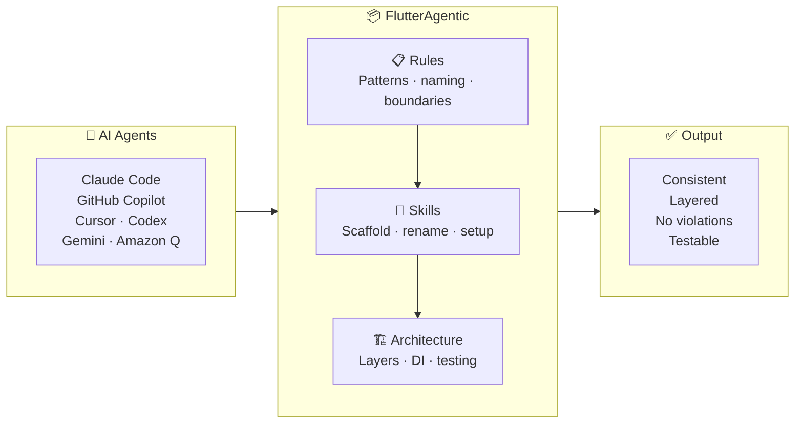
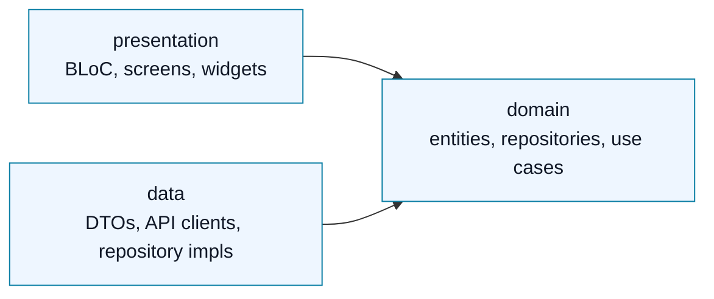

# FlutterAgentic

<p>
  
  
  
  
</p>

**An open-source, AI-first Flutter frontend starter.**

FlutterAgentic gives Flutter developers a production-grade Clean Architecture foundation that AI coding agents can actually follow. Fork it, open it in Claude Code, Codex, GitHub Copilot, Cursor, Gemini, Android Studio, or Amazon Q, and the agent gets the same architecture rules, forbidden patterns, naming conventions, test expectations, and feature scaffolding docs that a human teammate would use.

Most Flutter starters give you folders. FlutterAgentic gives you a rulebook plus a runnable app structure, so AI-generated code is less likely to drift into random widgets, leaked DTOs, untestable state, or inconsistent feature layouts.

The documentation is organised with the [Diataxis](https://diataxis.fr/) framework, so both humans and AI agents can quickly separate task guides, exact architecture reference, project reasoning, and operational coding rules.

## Why AI Agents Need Rules, Skills & Architecture

Think of an AI agent like a talented contractor joining your team. Without a handbook, every contractor codes differently — different file names, different patterns, different assumptions. After five features the codebase is a mess no one wants to touch.

FlutterAgentic is the handbook. Every agent that opens this repo gets the same rules, the same scaffold skills, and the same architecture blueprint — before writing a single line.



## AI Agent Support

FlutterAgentic includes repo-native instructions for Claude Code, Codex CLI, Cursor, Gemini, Android Studio, GitHub Copilot, and Amazon Q.

| Agent | Instruction source | Setup / scaffold path |
|---|---|---|
|  | `CLAUDE.md` | `/setup-project`, `/add-feature-template` |
|  | `AGENTS.md` + `.codex/skills/` | `$setup-project`, `$add-feature-template <name>` |
|  | `.github/copilot-instructions.md` | Repo-wide instructions; path-specific instructions can live in `.github/instructions/` |
|  | `.cursor/rules/` | Ask to set up or scaffold a feature |
|  | `GEMINI.md` | Ask to set up or scaffold a feature |
|  | `AGENTS.md` | Ask to set up or scaffold a feature |
|  | `.amazonq/rules/` | Rules are loaded from the repo |

Available skills:

- `setup-project` — checks Flutter/Dart setup, dependencies, generated files, hooks, run targets, and analysis.
- `add-feature-template` — scaffolds a new Clean Architecture feature with folders, class skeletons, BLoC state, screen/page files, and DI wiring.
- `rename-app` — renames the app across all platform files (iOS, Android, Web), Dart source, test imports, VS Code config, and all AI rules docs in one pass.
- `review-code` — audits generated or modified code against the project's architecture contracts, forbidden-pattern checklist, naming conventions, DI rules, and test coverage expectations. Run this after any code generation for best results.

## Why Fork This?

AI can generate Flutter quickly. The hard part is keeping the codebase consistent after the fifth feature.

FlutterAgentic is built for developers who want:

- A Flutter frontend template that is open-source and community-improvable
- Clean Architecture feature folders from day one
- BLoC + Freezed sealed events/states with exhaustive UI rendering
- `Either<Failure, T>` error handling instead of thrown exceptions across layers
- Dio + Retrofit networking with repository-level failure mapping
- GoRouter navigation and a central DI graph
- Design tokens and reusable UI atoms instead of hardcoded styling
- Agent instructions for Claude, Codex, Copilot, Cursor, Gemini, Android Studio, and Amazon Q
- A repeatable path for adding features without asking the AI to invent structure

The core project is Flutter-first. Backend, React, Node.js, Python, or other folders may become optional community examples later, but the main product is a high-quality Flutter frontend starter.

## At A Glance

| Area | Included |
|---|---|
| App shape | Flutter frontend starter with one complete example feature |
| Architecture | Feature-first Clean Architecture with strict layer boundaries |
| AI support | Repo-native instructions for eight AI coding surfaces |
| State | BLoC events/states generated with Freezed |
| Quality gates | Git hooks, analysis, tests, CI, and generated-code workflow |
| Extension path | Add features through documented scaffolding rules |

## How It Is Different

| Alternative | What it gives you | FlutterAgentic difference |
|---|---|---|
| Regular Flutter boilerplates | App folders, dependencies, sometimes example screens | Adds explicit AI-agent rules, forbidden patterns, docs, scaffold flow, tests, and architecture contracts |
| Paid AI Flutter starters like [Create Flutter App](https://createflutterapp.com/) | AI-optimised Flutter template with backend/product modules | FlutterAgentic is open-source, Flutter-frontend-first, and designed for community improvement |
| Paid kits with AI rules like [ApparenceKit](https://apparencekit.dev/flutter-templates/claude-rules/) | Commercial Flutter templates with `CLAUDE.md` rules for their architecture | FlutterAgentic ships multi-agent rules plus the runnable app, CI, tests, design tokens, and feature structure |
| Standalone skills like [building-flutter-apps](https://www.awesomeskills.dev/en/skill/sgaabdu4-building-flutter-apps) | An installable AI-agent skill for Flutter patterns | FlutterAgentic is repo-native: any new Flutter dev can fork, run, edit, and contribute to the app, rules, docs, examples, and verification commands together |

## Stack

| Concern | Library |
|---|---|
| State management | [flutter_bloc](https://pub.dev/packages/flutter_bloc) |
| Dependency injection | [get_it](https://pub.dev/packages/get_it) — service locator (`sl<T>()`) |
| Navigation | [go_router](https://pub.dev/packages/go_router) |
| Networking | [Dio](https://pub.dev/packages/dio) + [Retrofit](https://pub.dev/packages/retrofit) |
| Models / serialization | [Freezed](https://pub.dev/packages/freezed) + [json_serializable](https://pub.dev/packages/json_serializable) |
| Error handling | [fpdart](https://pub.dev/packages/fpdart) (`Either<Failure, T>`) |

## Documentation System

The docs use the [Diataxis](https://diataxis.fr/) approach: separate docs by the reader's need instead of mixing everything into one long guide. Diataxis defines four documentation modes: tutorials, how-to guides, reference, and explanation.

| Need | Folder | Purpose |
|---|---|---|
| Do a task | [`docs/how-to/`](docs/how-to/) | Step-by-step guides for setup, contribution, features, and use cases |
| Look up exact rules | [`docs/reference/`](docs/reference/) | Architecture, naming, dependency boundaries, DI, error flow, and tests |
| Understand why | [`docs/explanation/`](docs/explanation/) | Product vision, agent setup, and reasoning behind the template |
| Guide AI agents | [`docs/ai-rules/`](docs/ai-rules/) | Operational conventions loaded by agent instruction files |

Tutorial-style docs can be added later when the project has more real app examples.

## Architecture

Each feature lives under `lib/feature/{name}/` with three layers:



```text
feature/jokes/
├── data/               # API clients, DTOs, repository implementations
├── domain/             # Entities, repository interfaces, use cases (pure Dart)
└── presentation/       # BLoC + screens + widgets
```

The dependency rule is simple:

```text
presentation  ->  domain  <-  data
```

Domain never imports Flutter, Dio, Retrofit, or presentation code. Data never imports UI or BLoC code. Presentation never imports Dio or Retrofit.

See [`docs/reference/architecture.md`](docs/reference/architecture.md) for folder structure, naming, DI, error flow, design system rules, and testing patterns.

## Architecture in Practice

The `jokes` feature is a complete, working reference implementation of every layer. Here is the full stack from API call to rendered UI — no hand-waving.

**Domain entity** — pure Dart, no framework imports:
```dart
// lib/feature/jokes/domain/entities/joke_entity.dart
class JokeEntity {
  final String id;
  final String content;
  const JokeEntity({required this.id, required this.content});
}
```

**Repository interface** — domain owns the contract, data fulfils it:
```dart
// lib/feature/jokes/domain/repository/jokes_repository.dart
abstract interface class JokesRepository {
  Future<Either<Failure, JokeEntity>> getRandomJoke();
  Future<Either<Failure, JokeSearchResultEntity>> searchJokes(SearchJokesParams params);
}
```

**Repository implementation** — maps Dio failures to typed `Left`, maps DTOs to entities:
```dart
// lib/feature/jokes/data/repository_impl/jokes_repository_impl.dart
class JokesRepositoryImpl with BaseRepository implements JokesRepository {
  final JokesRemoteDataSource _dataSource;
  const JokesRepositoryImpl(this._dataSource);

  @override
  Future<Either<Failure, JokeEntity>> getRandomJoke() =>
      handleRequest(() async {
        final model = await _dataSource.getRandomJoke();
        return right(JokeEntity(id: model.id, content: model.joke));
      });
}
```

**BLoC** — sealed Freezed states, no `setState`, no nullable fields:
```dart
// lib/feature/jokes/presentation/bloc/joke_bloc.dart
class JokeBloc extends Bloc<JokeEvent, JokeState> {
  JokeBloc({required GetRandomJokeUseCase getRandomJokeUseCase})
      : _getRandomJoke = getRandomJokeUseCase,
        super(const JokeState.loading()) {
    on<JokeStarted>(_onStarted);
  }

  Future<void> _onStarted(JokeStarted event, Emitter<JokeState> emit) async {
    final result = await _getRandomJoke(const NoParams());
    result.fold(
      (failure) => emit(JokeState.error(message: failure.message)),
      (joke)    => emit(JokeState.loaded(joke: joke)),
    );
  }
}
```

**Screen** — exhaustive `switch`, no `if (state is X)`, no raw `CircularProgressIndicator`:
```dart
// lib/feature/jokes/presentation/view/jokes_screen.dart
builder: (context, state) => switch (state) {
  JokeLoading()           => const LoadingIndicator(),
  JokeLoaded(:final joke) => JokeCard(joke: joke),
  JokeError(:final msg)   => ErrorView(message: msg),
},
```

Every layer is independently testable with manual fakes — no mocks, no real network calls. See [`test/`](test/) for use case, BLoC, and widget tests.

**Business logic flow** — a user action travels through every layer in one direction, and the UI never decides anything:

```
User taps "Next Joke"
  → screen dispatches JokeEvent.nextRequested()         (UI layer — zero logic)
  → JokeBloc calls GetRandomJokeUseCase(NoParams())     (BLoC — orchestration only)
  → use case calls JokesRepository.getRandomJoke()      (domain — business rule lives here)
  → repository calls data source, maps DioException     (data — I/O + failure mapping)
  → returns Either<Failure, JokeEntity>
  → BLoC folds the Either:
      Left(failure)  → emit(JokeState.error(...))
      Right(entity)  → emit(JokeState.loaded(...))      (BLoC — state decision)
  → screen switch(state) renders the right widget       (UI layer — zero logic again)
```

No business logic in `build()`. No `setState` for BLoC-derived values. No `DioException` reaching a widget. The screen is a pure function of state — it renders what the BLoC tells it to render, nothing more.

This extends to naming: events are **user intentions** (`nextRequested`, `submitted`, `chipSelected`), not API calls (`fetchJoke`, `callSearchApi`). States are **business outcomes** (`loaded`, `nextFetchFailed`), not flag combinations (`isLoading: true, error: null`). A separate `nextFetchFailed` state keeps the current joke visible while reporting the error — a design decision that cannot be expressed with nullable fields.

---

## Using This as a Template

1. Click **Use this template** on GitHub to create your repo.
2. Clone your new repo.
3. Run `make setup` to install git hooks and fetch packages.
4. Run `make gen` to generate Freezed / Retrofit code.
5. Run `make test` to verify the starter.
6. Replace or extend the `jokes` feature with your first real feature.

```bash
make setup   # first-time: git hooks + flutter pub get
make run     # flutter run on a connected device
make web     # flutter run -d chrome
make test    # flutter test
make analyze # flutter analyze
make gen     # dart run build_runner build --delete-conflicting-outputs
```

<details>
<summary>Command reference</summary>

| Command | Purpose |
|---|---|
| `make setup` | First-time setup: git hooks + `flutter pub get` |
| `make run` | Run on a connected device |
| `make web` | Run in Chrome |
| `make test` | Run Flutter tests |
| `make analyze` | Run static analysis |
| `make gen` | Generate Freezed / Retrofit code |

</details>

## Running the Example

```bash
make setup
make gen
make run
```

The example feature fetches dad jokes from [icanhazdadjoke.com](https://icanhazdadjoke.com) and demonstrates the full data -> domain -> presentation stack, including search, saved jokes, BLoC state, repository mapping, and widget tests.

## Project Structure

```text
lib/
├── core/
│   ├── base/            # BasePage, BaseScreen, BaseRepository
│   ├── constants/       # API base URLs, app-wide string constants
│   ├── di/              # injection_container.dart, full dependency graph
│   ├── error/           # Failure sealed class
│   ├── network/         # Dio client factory + interceptors
│   ├── theme/           # AppTheme, AppSpacing, AppRadius, AppColorsExtension
│   └── ui/
│       ├── atoms/       # AppButton, AppTextField, AppBadge, AppChip, AppTopBar
│       └── molecules/   # AppBottomSheet, ErrorView, LoadingIndicator
├── feature/
│   └── jokes/           # Full example feature
├── app.dart             # MaterialApp.router + GoRouter config
└── main.dart            # Entry point

test/
├── helpers/             # Shared fakes
├── unit/feature/jokes/  # Use case + BLoC unit tests
└── widget/feature/jokes/# Screen widget tests

docs/
├── ai-rules/            # Conventions loaded by agent instruction files
├── explanation/         # End goal and AI agent setup
├── how-to/              # Contributing, add-feature, add-usecase guides
└── reference/           # Architecture reference
```

## Roadmap

- App checkbox and radio group atoms
- Snackbar and dialog helpers
- Notifications foundation
- Deep link foundation
- Secure storage foundation
- Pagination helpers for list features
- Responsive web layout helpers
- Second non-jokes example feature
- More community-reviewed agent rules and feature templates

## CI

GitHub Actions runs on every push and pull request:

- `dart run build_runner build --delete-conflicting-outputs`
- `flutter analyze --fatal-infos`
- `flutter test --coverage`

See [`.github/workflows/validate.yml`](.github/workflows/validate.yml).

## A Note on AI-Generated Code

FlutterAgentic gives every AI agent the same rules, patterns, and architecture contracts — but it does not guarantee perfect output on the first attempt.

AI agents are probabilistic. They can miss a rule, drift on a complex feature, or make a subtle layer violation even with a full rulebook in front of them. **That is normal.** The value of this template is not that agents get it right once — it is that they get it right consistently across iterations, because every review and every retry is anchored to the same rules.

**The recommended workflow:**

1. Generate code with your agent of choice
2. Run `/review-code` (or `$review-code`) — the agent re-reads the project rules and checks the generated output against them
3. Fix any flagged issues and iterate

Two or three iterations with a shared rulebook produces far better results than ten iterations without one.

> `/review-code` is a skill in this repo. It reads the architecture contracts, forbidden-pattern checklist, and naming conventions, then audits the code you just generated and reports exactly what to fix.

## Quick Links

| Start here | Reference | Build |
|---|---|---|
| [Use as a template](#using-this-as-a-template) | [Architecture](docs/reference/architecture.md) | [`make setup`](#using-this-as-a-template) |
| [AI agent support](#ai-agent-support) | [AI agents](docs/explanation/ai-agents.md) | [`make test`](#ci) |
| [Feature guide](docs/how-to/add-feature-template.md) | [Docs system](#documentation-system) | [`make analyze`](#ci) |
